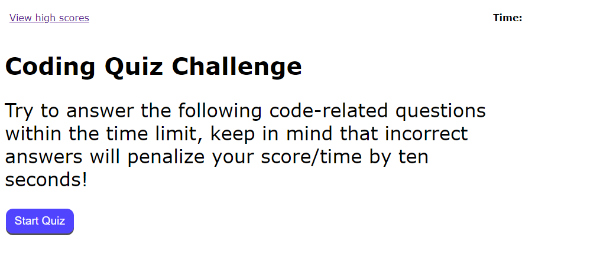

# js_fundamentals_quiz

# This a timed JavaScript fundamentals quiz

link: https://caleeeb.github.io/js-fundamentals-quiz/

## What to expect:

1. A home explaing the rules of the quiz that also includes a link to the high score.
2. A series of five JaveScript multiple choice questions given one by one.
3. A countdown timer which determines user's end score.
4. Wrong answers result in a reduction to the timer, effecting end score. 

## Have Fun!

